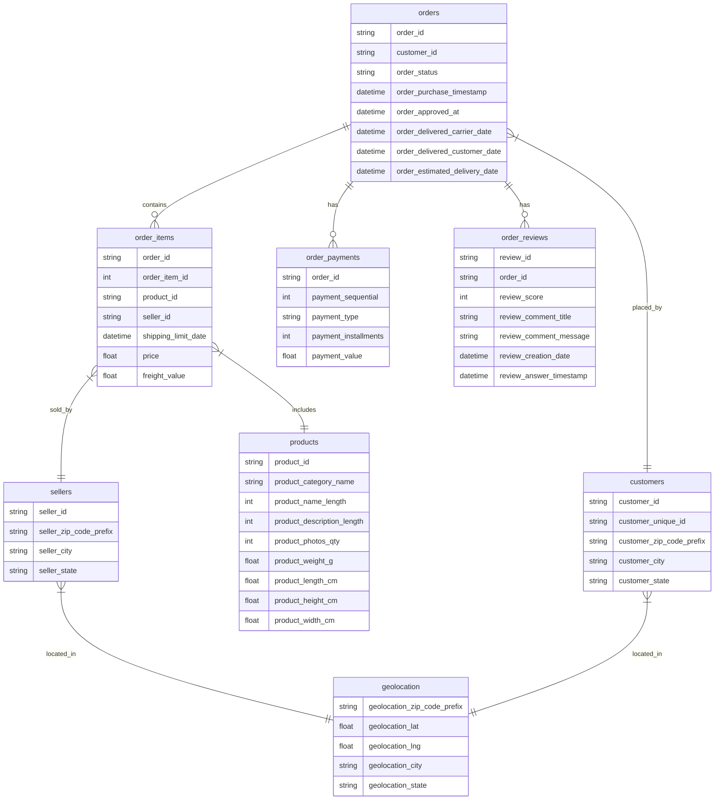

```mermaid
erDiagram
    orders ||--o{ order_items : contains
    orders ||--o{ order_payments : has
    orders ||--o{ order_reviews : has
    orders }|--|| customers : placed_by
    order_items }|--|| products : includes
    order_items }|--|| sellers : sold_by
    sellers }|--|| geolocation : located_in
    customers }|--|| geolocation : located_in

    orders {
        string order_id
        string customer_id
        string order_status
        datetime order_purchase_timestamp
        datetime order_approved_at
        datetime order_delivered_carrier_date
        datetime order_delivered_customer_date
        datetime order_estimated_delivery_date
    }

    order_items {
        string order_id
        int order_item_id
        string product_id
        string seller_id
        datetime shipping_limit_date
        float price
        float freight_value
    }

    order_payments {
        string order_id
        int payment_sequential
        string payment_type
        int payment_installments
        float payment_value
    }

    order_reviews {
        string review_id
        string order_id
        int review_score
        string review_comment_title
        string review_comment_message
        datetime review_creation_date
        datetime review_answer_timestamp
    }

    customers {
        string customer_id
        string customer_unique_id
        string customer_zip_code_prefix
        string customer_city
        string customer_state
    }

    sellers {
        string seller_id
        string seller_zip_code_prefix
        string seller_city
        string seller_state
    }

    products {
        string product_id
        string product_category_name
        int product_name_length
        int product_description_length
        int product_photos_qty
        float product_weight_g
        float product_length_cm
        float product_height_cm
        float product_width_cm
    }

    geolocation {
        string geolocation_zip_code_prefix
        float geolocation_lat
        float geolocation_lng
        string geolocation_city
        string geolocation_state
    }
```